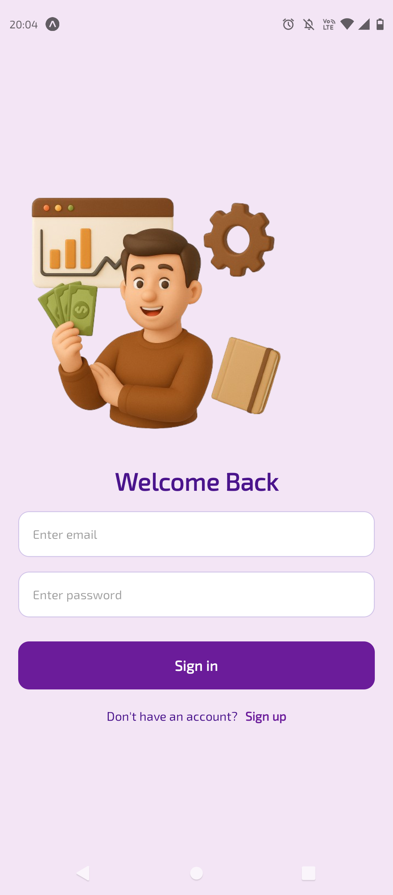
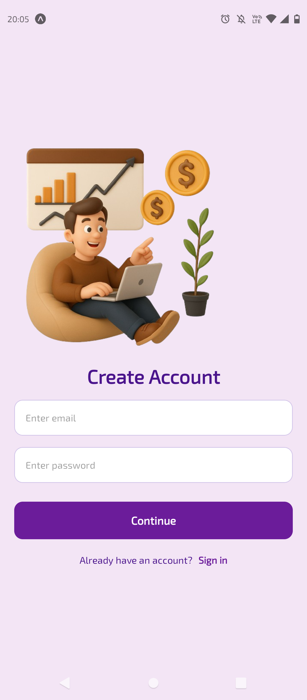
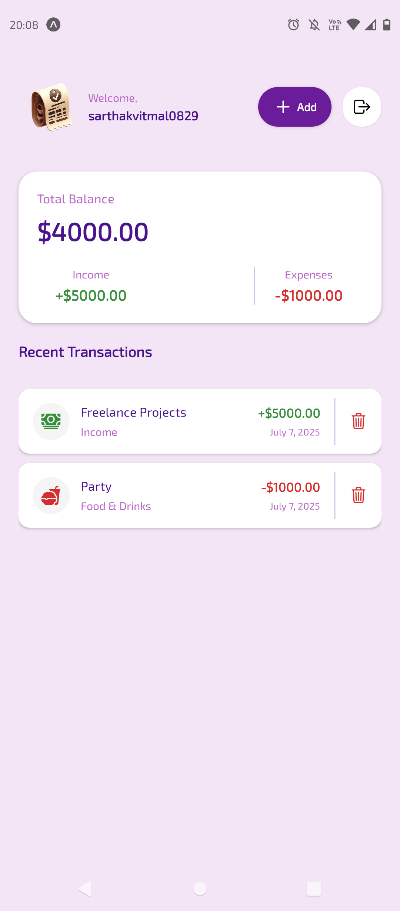
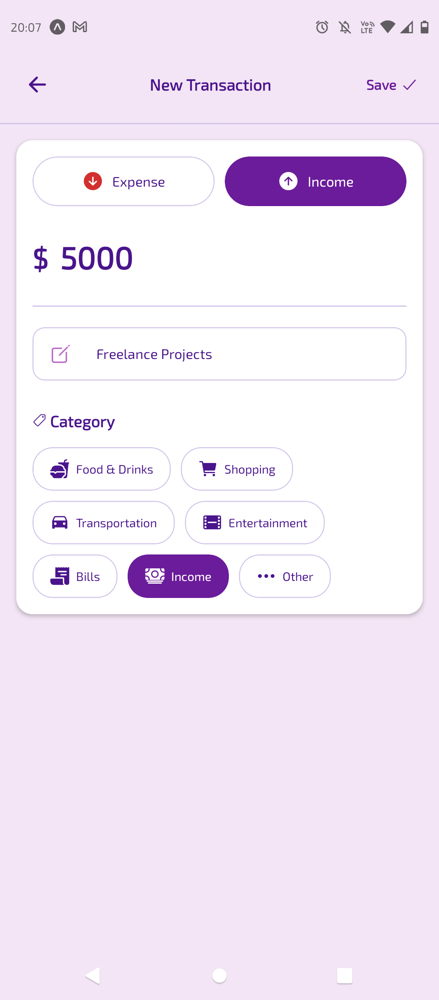

# Finlo - Personal Finance Wallet App �

A modern React Native personal finance wallet application built with Expo Router and Clerk authentication. Track your income, expenses, and manage your financial transactions with a beautiful, intuitive interface.

## � Screenshots
<div align="center">
  
  
</div>

<div align="center">
  
  
</div>

## �🚀 Features

- **Secure Authentication**: Integrated with Clerk for secure user authentication and management
- **Transaction Management**: Add, view, edit, and delete financial transactions
- **Categories**: Organize transactions by income and expense categories
- **Real-time Balance**: Live balance calculation based on your transactions
- **Beautiful UI**: Modern, responsive design with smooth animations
- **Cross-platform**: Runs on iOS, Android, and Web

## 🛠 Tech Stack

- **Framework**: React Native with Expo SDK 53
- **Navigation**: Expo Router (file-based routing)
- **Authentication**: Clerk
- **HTTP Client**: Axios
- **Styling**: React Native StyleSheet
- **Storage**: Expo Secure Store
- **State Management**: React Hooks
- **UI Components**: Custom components with Expo Vector Icons

## 📱 Project Structure

```
mobile/
├── app/                    # File-based routing
│   ├── _layout.jsx        # Root layout with Clerk provider
│   ├── (auth)/            # Authentication routes
│   │   ├── _layout.jsx    # Auth layout
│   │   ├── sign-in.jsx    # Sign in screen
│   │   └── sign-up.jsx    # Sign up screen
│   └── (root)/            # Protected routes
│       ├── index.jsx      # Home screen with transactions
│       └── create.jsx     # Create transaction screen
├── components/            # Reusable components
│   ├── BalanceCard.jsx    # Balance display component
│   ├── NoTransactionsFound.jsx
│   ├── PageLoader.jsx     # Loading component
│   ├── SafeScreen.jsx     # Safe area wrapper
│   ├── SignOutButton.jsx  # Sign out functionality
│   └── TransactionItem.jsx # Transaction list item
├── constants/             # App constants
│   ├── api.js            # API endpoints
│   └── colors.js         # Color palette
├── hooks/                 # Custom React hooks
│   └── useTransactions.js # Transaction data management
├── lib/                   # Utility functions
│   └── utils.js          # Helper functions
└── assets/               # Static assets
    ├── images/           # App images and icons
    ├── fonts/            # Custom fonts
    └── styles/           # Shared styles
```

## 🏁 Getting Started

### Prerequisites

- Node.js (v18 or later)
- npm or yarn
- Expo CLI
- iOS Simulator (for iOS development)
- Android Studio/Emulator (for Android development)

### Installation

1. **Clone the repository**
   ```bash
   git clone <repository-url>
   cd react-native-wallet/mobile
   ```

2. **Install dependencies**
   ```bash
   npm install
   ```

3. **Set up environment variables**
   Create a `.env` file in the mobile directory:
   ```env
   EXPO_PUBLIC_CLERK_PUBLISHABLE_KEY=your_clerk_publishable_key
   EXPO_PUBLIC_API_BASE_URL=your_backend_api_url
   ```

4. **Start the development server**
   ```bash
   npx expo start
   ```

### Running the App

- **iOS Simulator**: Press `i` in the terminal or scan the QR code with the Camera app
- **Android Emulator**: Press `a` in the terminal or scan the QR code with the Expo Go app
- **Physical Device**: Install Expo Go app and scan the QR code
- **Web**: Press `w` in the terminal

## 🔧 Available Scripts

```bash
# Start the development server
npm start

# Run on iOS simulator
npm run ios

# Run on Android emulator
npm run android

# Run on web
npm run web

# Lint the code
npm run lint

# Reset project to blank template
npm run reset-project
```

## 📄 Key Components

### Authentication Flow
- **Sign In/Sign Up**: Handled by Clerk with email/password
- **Protected Routes**: Automatic redirection based on auth state
- **Session Management**: Secure token storage with Expo Secure Store

### Transaction Management
- **Create Transactions**: Add income or expense with title, amount, and category
- **View Transactions**: List all transactions with filtering options
- **Edit/Delete**: Modify or remove existing transactions
- **Balance Calculation**: Real-time balance updates

### API Integration
- **REST API**: Communicates with backend server for data persistence
- **Error Handling**: Comprehensive error management and user feedback
- **Loading States**: Smooth loading indicators during API calls

## 🎨 Styling

The app uses a modern design system with:
- **Color Scheme**: Custom color palette defined in `constants/colors.js`
- **Typography**: Clean, readable fonts with proper hierarchy
- **Spacing**: Consistent spacing and layout patterns
- **Responsive Design**: Adapts to different screen sizes

## 🔐 Environment Configuration

Required environment variables:

```env
# Clerk Authentication
EXPO_PUBLIC_CLERK_PUBLISHABLE_KEY=pk_test_...

# Backend API
EXPO_PUBLIC_API_BASE_URL=http://localhost:3000/api
```

## 📱 Platform Support

- **iOS**: iOS 11.0+
- **Android**: Android 6.0+ (API level 23)
- **Web**: Modern browsers with ES6 support

## 🐛 Troubleshooting

### Common Issues

1. **Metro bundler issues**
   ```bash
   npx expo start --clear
   ```

2. **iOS simulator not loading**
   ```bash
   npx expo run:ios --device
   ```

3. **Android build errors**
   ```bash
   npx expo run:android --clear
   ```

4. **Clerk authentication issues**
   - Verify your publishable key in the environment variables
   - Check Clerk dashboard for proper domain configuration

## 🚀 Deployment

### EAS Build (Recommended)

1. **Install EAS CLI**
   ```bash
   npm install -g @expo/eas-cli
   ```

2. **Login to Expo**
   ```bash
   eas login
   ```

3. **Build for production**
   ```bash
   # iOS
   eas build --platform ios
   
   # Android
   eas build --platform android
   
   # Both platforms
   eas build --platform all
   ```

### Expo Updates
For over-the-air updates:
```bash
eas update --branch production
```

## 🤝 Contributing

1. Fork the repository
2. Create a feature branch (`git checkout -b feature/amazing-feature`)
3. Commit your changes (`git commit -m 'Add some amazing feature'`)
4. Push to the branch (`git push origin feature/amazing-feature`)
5. Open a Pull Request

## 📄 License

This project is licensed under the MIT License - see the LICENSE file for details.

## 🙏 Acknowledgments

- [Expo](https://expo.dev) for the amazing development platform
- [Clerk](https://clerk.com) for authentication services
- [React Native](https://reactnative.dev) community for excellent documentation

## 📞 Support

For support, email support@finlo.app or join our community Discord server.

---

Built with ❤️ using React Native and Expo
